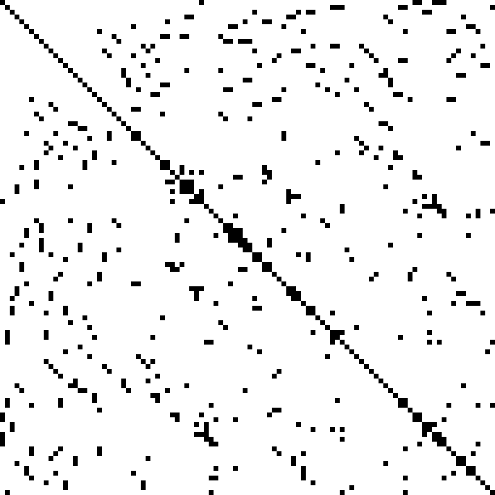

## **Linear system conjugate gradient solver**

Imlementation of linear system solver using Jacobi preconditioner. Using OpenMP for parrallelizing.

#### Compilation 

First you must ensure you have OpenMP library installed in your system. For example, the g++ compiler option `-fopenmp` is dedicated for using the library. Project is built with the help of GNU Make. Current version allows usage of IBM and GNU compilers for C++: xlc++\_r (thread-safe instance) and g++. Code is intended for running on IBM BlueGene/P, IBM Polus and generic computers supporting at least C++98 and OpenMP 3.0+. Compilation:

For IBM BlueGene/P: `make bgp`;
for IBM Polus: `make polus`;
for computer with g++ compiler: `make gnu`.

#### Running

Use the result of installation make command, i.e. `./solver`.

#### Cleaning out

`make clean`
